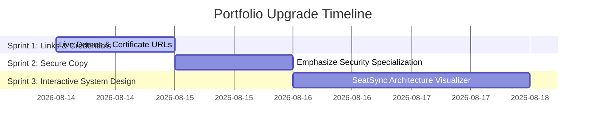

# Sprint Plan: Portfolio Upgrade

To take the portfolio to a senior-grade, hiring-manager-approved level, we will execute the upgrades in three organized sprints.

## 📋 Sprint Overview

---

## 🏃‍♂️ Sprint 1: Interactive Links & Credentials
**Goal:** Make the portfolio highly actionable for recruiters by adding direct live demo links and certification verifications.

* [x] **Task 1.1:** Add "Live Demo" buttons to the web-deployed projects:
  * **SeatSync:** `https://seat-sync-ecru.vercel.app`
  * **AetherCast:** `https://podcast-frontend-roan.vercel.app`
  * **GateLabs:** `https://gatelabs-taupe.vercel.app`
* [x] **Task 1.2:** Add "Verify Credential" links to the Certifications section:
  * **Oracle GenAI:** `https://mylearn.oracle.com/ou/learning-path/oracle-cloud-infrastructure-2025-certified-generative-ai-professional/141094`
  * **Google Cybersecurity:** Add verification link/placeholder.
  * **TATA Forage:** Add verification link/placeholder.
  * **Pantech Prolabs:** Add verification link/placeholder.
* [x] **Task 1.3:** Style the new actions to seamlessly match the current dark-tech CSS styling system.

---

## 🏃‍♂️ Sprint 2: Secure Coding & Systems Copy
**Goal:** Align your portfolio content with your B.Tech CSE (Information Security) specialization, framing you as a developer who builds secure-by-design APIs.

* [x] **Task 2.1:** Refine the Hero subhead and About Me text to highlight secure coding practices.
* [x] **Task 2.2:** Add specific security technologies (OWASP Top 10, JWT signature checking, CORS, sanitization, encryption) to the skills modules.

---

## 🏃‍♂️ Sprint 3: Interactive Architecture Visualizer
**Goal:** Add a high-impact interactive systems architecture visualizer under your top project, `SeatSync`, demonstrating microservices understanding.

* [x] **Task 3.1:** Design a CSS/HTML interactive component showing the microservices flow of `SeatSync`.
* [x] **Task 3.2:** Wire up click-to-explore interactions (e.g. clicking on Kafka, Redis, or PostgreSQL highlights how that component solves concurrency).
